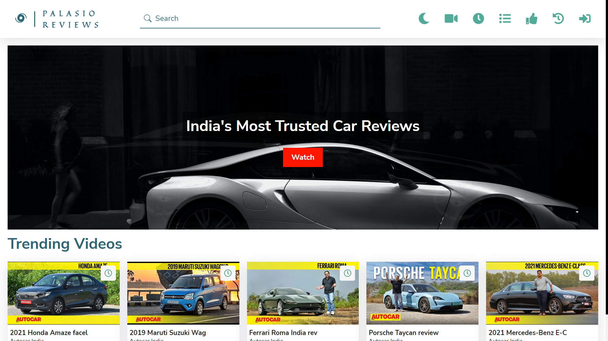
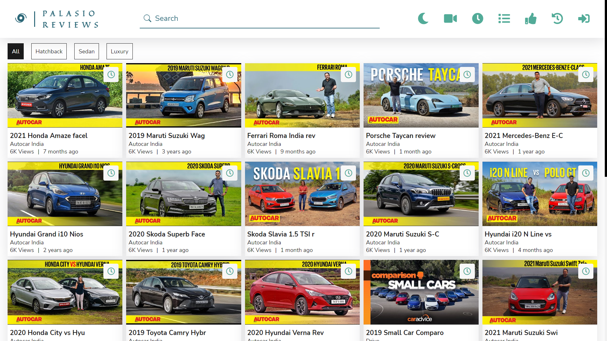
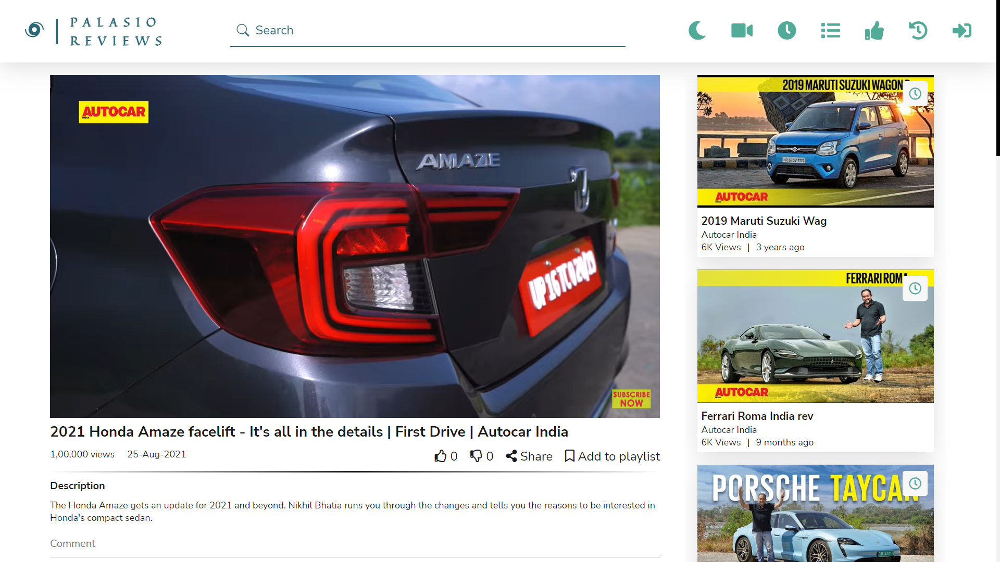
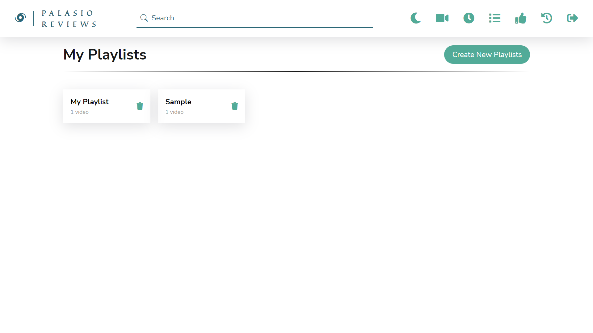
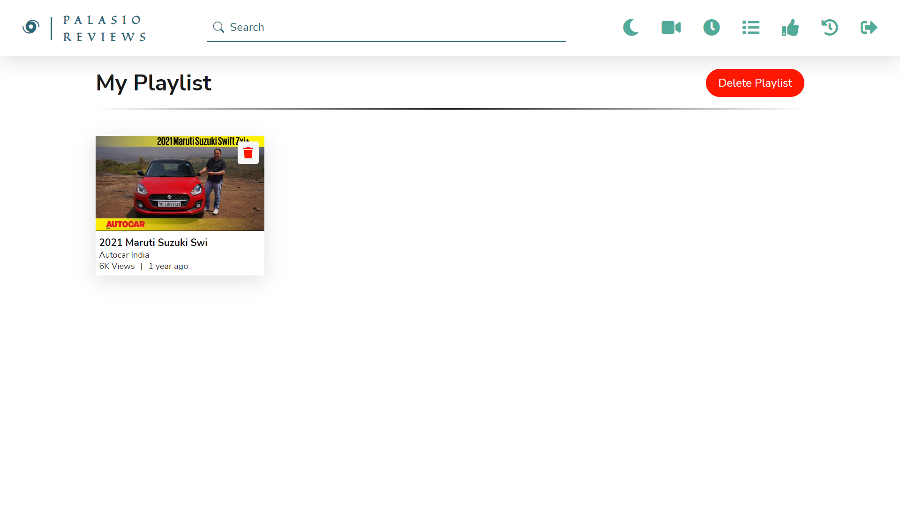

# Palasio Reviews

Watch India's most trusted Car Review at one place at Palasio Reviews!

---

## Tech Stack

**Client:** React, React Router

**Server:** Node, Express, MongoDB, Mongoose

**Authentication:** JWT, Password Encryption with Bcrypt

## Functionalities

- Video Listing Page
- Playlist Management
- Like, Dislike & Comments
- History & Watch Later
- Single Video Page
- Loader, Toast
- Dark Mode

## Screenshots

## 🌐 Demo

Have a look at the live demo of [Palasio Reviews](https://palasio-reviews.netlify.app/).

## 🚀 About Me

I'm a full stack developer (MERN). I have always been fascinated by technologies and how they have made our lives better. So learning and exploring new things have always made me happier.

## 🔗 Links

---